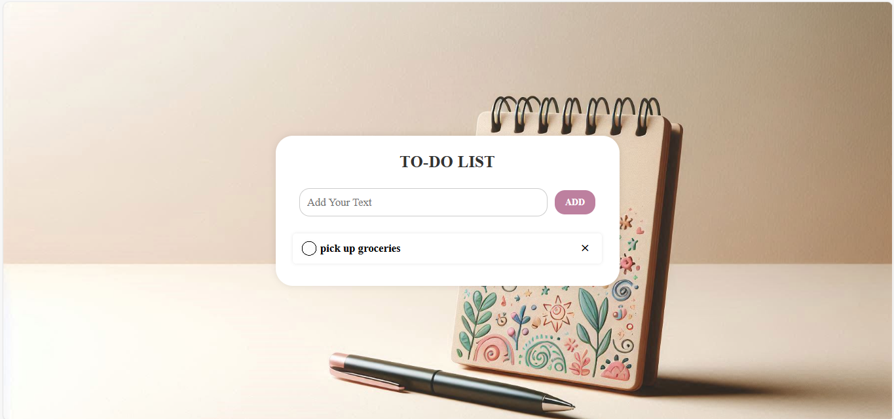

# 📝 To-Do List Web App

A clean and responsive To-Do List web application built using **HTML**, **CSS**, and **JavaScript** to help users manage their daily tasks with ease.

---

## 📌 Features

- ✅ Add tasks to the list
- ❌ Remove completed tasks
- 🖱️ Click to mark tasks as done/undone
- 🎨 Aesthetic UI with a background image and styled components

---


## 🖼️ Screenshot



---

## 🛠️ Technologies Used

- **HTML5** for structure
- **CSS3** for styling
- **JavaScript** for logic and interactivity

---

## 🚀 How to Use

1. Clone the repository:
   ```bash
   git clone https://github.com/your-username/to-do-list.git

